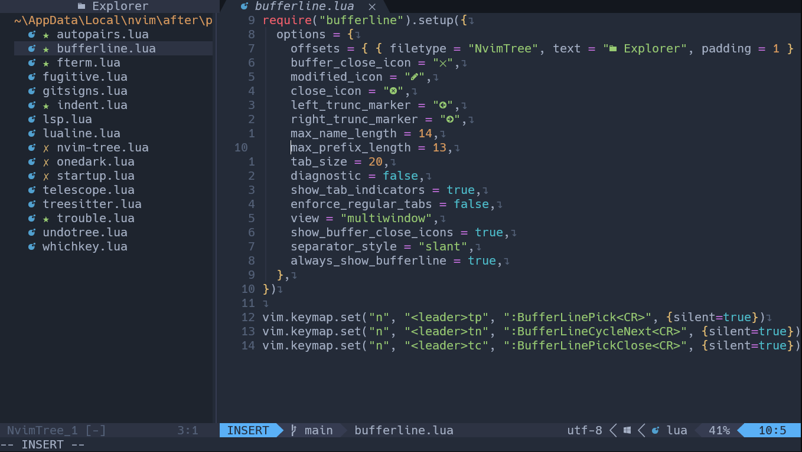

# Neovim Dotfiles
These are the neovim dotfiles for my personal use as I am trying to switch to Neovim full time. You can head over [here](./lua/vedant/packer.lua) to see the installed packages.

# Preview:




# Requirements
- Neovim v0.9.1 or above
- NodeJS
- GCC/Any Other C compiler

# Installation [Windows]
Make sure to take a backup of your neovim config before copying mine.
```
cd nvim
git clone https://github.com/V3dantSh4rma/dotfiles .
```

Install [Packer.nvim](https://github.com/wbthomason/packer.nvim) before typing ``nvim`` in the terminal.

# Treesitter/LSP/COC Install
You can use the following commands to install the desired treesitter/parsers for your languages.
- ``:LspInstall <args>``
- ``:TSInstall <args>``
- ``:CocInstall <args>``


# Keymaps
- ``<Leader>ff`` - Nvim Telescope
- ``<Leader>gs`` - Git
- ``gd`` - Get definition
- ``<Leader>u`` - Open Undotree
- ``<leader>tt`` - Toggle File Tree
- ``<leader>tf`` - Focus on FileTree
- ``<leader>s`` - Save
- ``<leader>xx`` - Open Code Analysis
- ``<A-t>`` - Toggle Terminal
- ``<leader>tp`` - Buffer Pick
- ``<leader>tc`` - Buffer Close
- ``<leader>tn`` - Bufferline Cycle Next